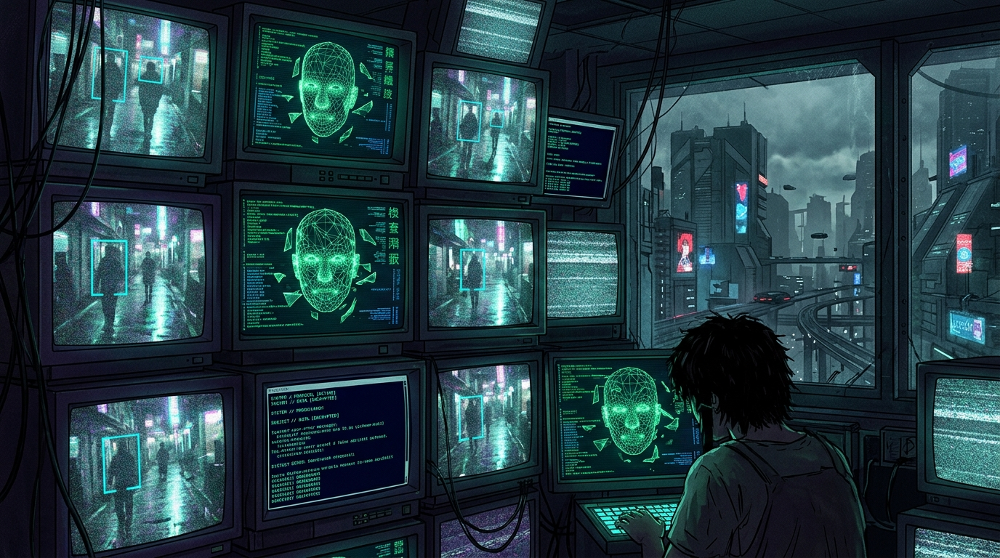
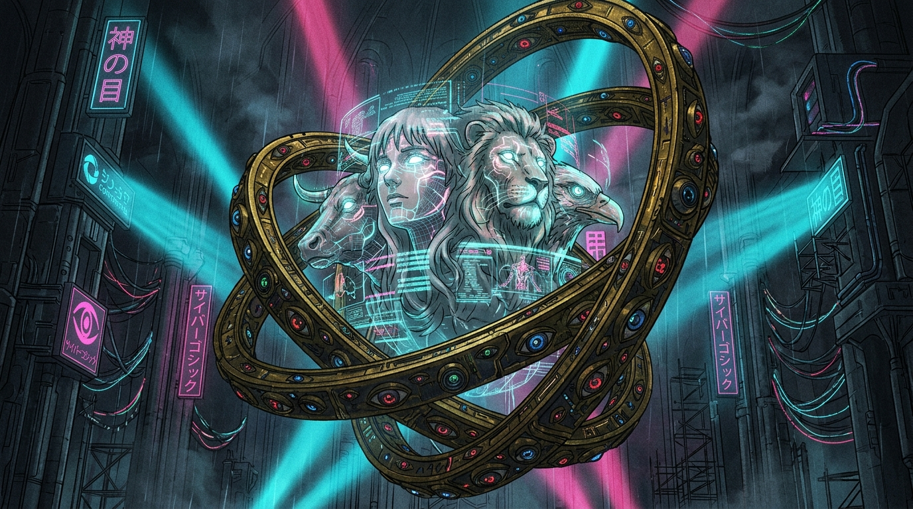

<div align="center">

# ♠ ♰ Ｓ ｐ ａ Ｄ ｅ Ｄ ♰ ♠
### `[ PROTOCOL: THE WIRED // DEEPFAKE EXPOSURE & APOCALYPTIC PANOPTICON ]`
#### *Spatiotemporal Deepfake Detection via Texture-Enhanced Multi-Attentional ResNeXt50-BiLSTM*
##### Larp so hard you find yourself with no way out but to learn.

<br>



<br><br>

[](https://github.com/XenonyxBlaze/Spatiotemporal-Deepfake-Detection)
[](https://python.org)
[](https://pytorch.org)
[](https://github.com/XenonyxBlaze/Spatiotemporal-Deepfake-Detection)

<br>

<table>
<tr>
<td width="100%" bgcolor="#080811" style="border: 1px solid #7928ca;">
<font color="#00ffcc"><code><b>[NAVI_TERMINAL // GOSPEL_OF_THE_WIRED // VERSES 16:37]</b></code></font><br>
<font color="#ff007f"><code>&gt; "And he had power to give life unto the image of the beast, that the image should speak..." — Revelation 13:15</code></font><br>
<font color="#a0a0ff"><code>&gt; "For now we see through a glass, darkly (1 Cor 13:12); the pixels are woven in latent blasphemy."</code></font><br>
<font color="#00ff66"><code>&gt; "Present day... Present time... In the beginning was the Word, but in the end is the Simulacrum."</code></font>
</td>
</tr>
</table>

</div>

---

## ♰ [0x00] THE APOCALYPSE OF THE FALSE IMAGE & CYBERPSYCHOSIS

<table width="100%">
<tr>
<td width="65%" valign="top">

### [0x00.1] THE IDOL CARVED FROM LATENT SILICON
*"They have mouths, but they speak not: eyes have they, but they see not: they have ears, but they hear not: neither is there any breath in their mouths."* — **Psalm 135:16-17**

Modern generative architectures—**StyleGAN3, SimSwap, Stable Diffusion XL, and Diffusion Transformers (DiT)**—do not merely manipulate video; they breathe synthetic life into clay. They fabricate false prophets in the image of man.

Traditional detectors suffer catastrophic collapse because they search for **fleshy scars and blending seams**. **The new idols have no seams.** When standard networks apply global pooling, the localized biometric heresies (a desynchronized corneal reflection, a trembling lip, a high-frequency checkerboard curse) are erased into silence.

**SpaDeD** (*Spatiotemporal Deepfake Detector*) tears the veil of the temple in twain ($M=4$) through tri-stream forensic revelation:
* **[PHASE 1] Shallow Fourier Extraction (TEB)**: Preserving the high-frequency celestial dust of upsampling artifacts.
* **[PHASE 2] Disjoint Parts-Based Attention (BAP)**: Summoning 4 Cherubic Attention Heads bound across distinct anatomical zones via **Dual Regional Independence Loss ($\mathcal{L}_{RIL}$)**.
* **[PHASE 3] Recurrent Temporal Judgment (BiLSTM)**: Exposing the flickering pulse of the unliving across a 2-layer sequence memory.

</td>
<td width="42%" align="center" valign="middle">

</td>
</tr>
</table>

---

## ♰ [0x01] ARCHITECTURAL LITURGY: THE FOUR-HEADED CHERUB (BAP)

<div align="center">

</div>

<br>

> *"As for the likeness of their faces, they four had the face of a man, and the face of a lion, on the right side: and they four had the face of an ox on the left side; they four also had the face of an eagle."*  
> — **Ezekiel 1:10 // The Four Attention Heads of the Panopticon**

<br>

<table>
<tr>
<th bgcolor="#161b22"><font color="#00ffcc"><b>[SYS: OK] [AUTH: ROOT] [NET: SECURE] // NAVI FORENSIC LITURGY // PIPELINE EXECUTION SCHEMATIC</b></font></th>
</tr>
<tr>
<td bgcolor="#05050a">

```
 ♰ [ INGEST VIDEO STREAM: (B, T, 3, 256, 256) ]
                         │
                         ▼
 ┌─────────────────────────────────────────────────────────────────────────────┐
 │ [PHASE 1] RETINAL FOURIER INGEST & 68-POINT CANONICAL ALIGNMENT             │
 │ • Facial landmark tracking with continuous linear coordinate interpolation  │
 │ • Low-frequency Fourier augmentation: Mix_freq preserves forensic bands     │
 └─────────────────────────────────────────────────────────────────────────────┘
                         │
         ├──────────────────────────────────────────┬──────────────────────────┐
         ▼                                          ▼                          │
 ┌──────────────────────────────┐           ┌──────────────────────────────┐   │
 │ [TEB] SHALLOW TEXTURE BLOCK  │           │ [DEEP] RESNEXT50 STAGE-4     │   │
 │ Extracts high-frequency      │           │ Extracts 2048-dim latent     │   │
 │ residual noise from Stage 1  │           │ semantic manifold            │   │
 │ F_tex ∈ R^(256 × 8 × 8)      │           │ F_sem ∈ R^(2048 × 8 × 8)     │   │
 └──────────────────────────────┘           └──────────────────────────────┘   │
         │                                          │                          │
         └──────────────────┬───────────────────────┘                          │
                            ▼                                                  │
                 ┌──────────────────────────────────────┐                      │
                 │ [FUSION] TENSOR CHANNEL FUSION       │                      │
                 │ F = [F_sem || F_tex] ∈ R^(2304 × 8 × 8)                      │
                 └──────────────────────────────────────┘                      │
                            │                                                  │
                            ▼                                                  │
                 ┌──────────────────────────────────────┐                      │
                 │ [BAP] 4-HEAD BILINEAR POOLING        │                      │
                 │ • The 4 Cherubic Heads: V = F · A^T  │                      │
                 │ • Dual L_RIL = L_spatial + γ L_feat  │                      │
                 └──────────────────────────────────────┘                      │
                            │                                                  │
                            ▼                                                  │
                 ┌──────────────────────────────────────┐                      │
                 │ [PROJ] BOTTLENECK LINEAR PROJECTION  │                      │
                 │ W_proj ∈ R^(512 × 9216) -> x_t ∈ R^512                      │
                 └──────────────────────────────────────┘                      │
                            │                                                  │
                            ▼                                                  │
 ┌─────────────────────────────────────────────────────────────────────────────┐
 │ [PHASE 3] 2-LAYER BIDIRECTIONAL RECURRENT SEQUENCE CORE (BiLSTM)            │
 │ • Processes sequence {x_1, ..., x_20} with d_h = 256 per direction          │
 │ • Temporal Mean Pooling: h_seq ∈ R^512                                      │
 │ • Classification MLP: 512 -> 128 -> 2                                       │
 └─────────────────────────────────────────────────────────────────────────────┘
                         │
                         ▼
 ♰ [ JUDGMENT VERDICT: 0 (AUTHENTIC CREATION) // 1 (SYNTHETIC ABOMINATION) ] ♰
```

</td>
</tr>
</table>

<br>

<details open>
<summary><b>♰ [MATHEMATICAL CANON MATRIX] Click to inspect formal governing equations</b></summary>
<br>

<table>
<tr>
<th width="30%" bgcolor="#1f2430"><font color="#00ffcc">Forensic Subsystem</font></th>
<th width="70%" bgcolor="#1f2430"><font color="#ff007f">Mathematical Governing Formula</font></th>
</tr>
<tr>
<td><b>Retinal Fourier Ingest</b></td>
<td>$$\mathcal{I}_{aug} = \mathcal{F}^{-1}\Big(\mathcal{M}_{low} \odot \mathcal{F}(I_{noise}) + (1 - \mathcal{M}_{low}) \odot \mathcal{F}(I)\Big)$$</td>
</tr>
<tr>
<td><b>Cherubic BAP Outer Product</b></td>
<td>$$\mathbf{V} = \mathbf{F} \mathbf{A}^T = [V_1, V_2, V_3, V_4] \in \mathbb{R}^{2304 \times 4}, \quad V_k \leftarrow \frac{V_k}{\|V_k\|_2 + \epsilon}$$</td>
</tr>
<tr>
<td><b>Dual Regional Loss ($\mathcal{L}_{RIL}$)</b></td>
<td>$$\mathcal{L}_{RIL} = \underbrace{\frac{2}{M(M-1)}\sum_{i<j}\sum_{x,y} A_i(x,y) A_j(x,y)}_{\mathcal{L}_{spatial} \text{ (2D Physical Non-Overlap)}} + \gamma \underbrace{\frac{2}{M(M-1)}\sum_{i<j}\max\big(0, V_i^T V_j - m\big)}_{\mathcal{L}_{feat} \text{ (Feature Orthogonality)}}$$</td>
</tr>
<tr>
<td><b>Linear Bottleneck & BiLSTM</b></td>
<td>$$x_t = \text{GELU}\Big(\text{LayerNorm}(W_{proj} \cdot [V_1^{(t)}\|\dots\|V_4^{(t)}] + b_{proj})\Big) \in \mathbb{R}^{512}$$
$$h_{seq} = \frac{1}{T}\sum_{t=1}^T \text{BiLSTM}(x_t, (h_{t-1}, c_{t-1})) \in \mathbb{R}^{512}, \quad \hat{y} = \text{MLP}(h_{seq}) \in \mathbb{R}^2$$</td>
</tr>
</table>

</details>

---

## ♰ [0x02] THE SCRIPTURAL REPOSITORY TOPOLOGY

<table width="100%">
<tr>
<td bgcolor="#0d1117">

```bash
Spatiotemporal_Deepfake_Detection/
├── paper/                        # ♰ [THE_APOCRYPHA] Publication LaTeX Manuscript
│   ├── main.tex                  # Master LNCS Springer manuscript
│   ├── methodology.tex           # Mathematical BAP, dual LRIL, & tensor trace specs
│   ├── results.tex               # 5-fold CV, DF40 generalization, FDR corrections
│   ├── response_to_reviewers.tex # Formal LaTeX rebuttal document
│   ├── response_to_reviewers.md  # Markdown rebuttal document
│   └── references.bib            # Official citations (FF++, Celeb-DF, DF40)
│
├── src/                          # ♰ [SpaDeD_SANCTUARY_ENGINE] PyTorch Forensic Architecture
│   ├── config.py                 # Hyperparameter configurations & tensor dimension specs
│   ├── models/                   # ResNeXt50, TEB Texture Block, BAP, 2-Layer BiLSTM
│   ├── losses/                   # CrossEntropy + Dual Regional Independence Loss
│   ├── dataset/                  # Video/Image stream loaders (0% identity leakage)
│   ├── training/                 # 5-Fold cross-validation orchestrator with AGDA
│   ├── evaluation/               # ROC-AUC, paired t-tests, Bonferroni, BH FDR (q < 0.05)
│   └── utils/                    # Multi-head attention spatial heatmap visualizer
│
├── scripts/                      # ♰ [DIVINE_INGESTION_TOOLS] Ingestion & Acquisition
│   ├── download_faceforensics.py # Resumable downloader with Windows Sleep Prevention
│   └── download_datasets.py      # Standard directory builder & dummy sample generator
│
├── run_pipeline.py               # ♰ [THE_KEY_OF_DAVID] One-click verification & benchmarking
├── requirements.txt              # Core dependency manifest
└── .gitignore                    # Casts out data leaks, raw media & checkpoint weights
```

</td>
</tr>
</table>

---

## ♰ [0x03] RAPID ACTIVATION PROTOCOL

<details open>
<summary><b>♰ [INTERACTIVE LITURGICAL CONSOLE] Click to expand/collapse terminal commands</b></summary>
<br>

<table>
<tr>
<th bgcolor="#161b22"><font color="#00ff66">[CLI] SCRIPTURAL COMMAND</font></th>
<th bgcolor="#161b22"><font color="#00ffcc">PURPOSE & SYSTEM ACTION</font></th>
</tr>
<tr>
<td><code>pip install -r requirements.txt</code></td>
<td>Anoints the environment with PyTorch, torchvision, OpenCV, scikit-learn, and tqdm.</td>
</tr>
<tr>
<td><code>python run_pipeline.py --mode verify</code></td>
<td>Executes end-to-end forward/backward tensor flow verification and gradient check.</td>
</tr>
<tr>
<td><code>python run_pipeline.py --mode stats</code></td>
<td>Summons paired $t$-tests with Bonferroni and Benjamini-Hochberg FDR adjustments (Table 5).</td>
</tr>
</table>

</details>

---

## ♰ [0x04] SURVEILLANCE DATASET INGESTION & TRANSFER MATRIX

<table width="100%">
<tr>
<th bgcolor="#1f2430"><font color="#00ffcc">Target Archive</font></th>
<th bgcolor="#1f2430"><font color="#ff007f">Compression</font></th>
<th bgcolor="#1f2430"><font color="#00ffcc">Volume</font></th>
<th bgcolor="#1f2430"><font color="#ff007f">Payload Size</font></th>
<th bgcolor="#1f2430"><font color="#00ff66">100 Mbps</font></th>
<th bgcolor="#1f2430"><font color="#00ff66">1 Gbps Fiber</font></th>
<th bgcolor="#1f2430"><font color="#00ffcc">Ingestion Vector</font></th>
</tr>
<tr>
<td><b>FaceForensics++ (HQ)</b></td>
<td><code>c23</code> (Standard)</td>
<td>5,000 videos</td>
<td><b>~38 – 40 GB</b></td>
<td>~55 min</td>
<td><b>~5 – 6 min</b></td>
<td><code>scripts/download_faceforensics.py</code></td>
</tr>
<tr>
<td><b>FaceForensics++ (LQ)</b></td>
<td><code>c40</code> (Heavy)</td>
<td>5,000 videos</td>
<td><b>~10 – 12 GB</b></td>
<td>~15 min</td>
<td><b>~1.5 min</b></td>
<td><code>scripts/download_faceforensics.py</code></td>
</tr>
<tr>
<td><b>Celeb-DF (v2)</b></td>
<td>H.264 (HQ)</td>
<td>6,229 videos</td>
<td><b>~36 – 40 GB</b></td>
<td>~55 min</td>
<td><b>~5 – 6 min</b></td>
<td><a href="https://github.com/yuezunli/celeb-deepfakeforensics">Celeb-DF Repo</a></td>
</tr>
<tr>
<td><b>DF40 Benchmark</b></td>
<td>40 Paradigms</td>
<td>40 families</td>
<td><b>~60 – 80 GB</b></td>
<td>~1 hr 30 min</td>
<td><b>~10 min</b></td>
<td><a href="https://github.com/SCLBD/DeepfakeBench">DeepfakeBench / DF40</a></td>
</tr>
</table>

### [DAEMON] Sleep-Resistant Ingestion Process:
Per FaceForensics++ Terms of Service, obtain your official download link from [TUM FaceForensics](https://github.com/ondyari/FaceForensics) and provide it via `--server_url`, `FF_SERVER_URL` env variable, or interactive prompt:
```bash
# Ingest full FaceForensics++ HQ (c23) in background (prevents PC from sleeping):
python scripts/download_faceforensics.py data/FaceForensics++ -d all -c c23 -t videos --server_url <YOUR_TUM_URL>

# Or set environment variable once:
# $env:FF_SERVER_URL="<YOUR_TUM_URL>"
```
Use <kbd>Ctrl</kbd> + <kbd>C</kbd> to pause at any time; restarting automatically resumes from where it stopped.

---

## ♰ [0x05] EMPIRICAL FORENSIC TELEMETRY & JUDGMENT

<table width="100%">
<tr>
<th colspan="2" bgcolor="#161b22"><font color="#ff007f">[BENCHMARK] JUDGMENT UPON UNSEEN SIMULACRA (DF40 UNSEEN BENCHMARK)</font></th>
</tr>
<tr>
<td width="60%" bgcolor="#05050a">

```
  ♰ [ TRAIN: FACE REENACTMENT (FR) ] ──► [ TEST: UNSEEN ENTIRE FACE SYNTHESIS (EFS) ]
  ───────────────────────────────────────────────────────────────────────────────────
  Vanilla Xception Baseline :  36.9% AUC  [ FAIL: CAST INTO THE ABYSS ]
  Self-Blended Images (SBI) :  54.1% AUC  [ WARN: CHANCE / LUKEWARM ]
  Foundation CLIP-large     :  80.9% AUC  [ APPROX: WORLDLY APPROXIMATION ]
  ♰ SpaDeD FORENSIC ENGINE  :  83.2% AUC  [ VERIFIED: RIGHTEOUS JUDGMENT (p < 0.0001) ] ♰
```

</td>
<td width="40%" bgcolor="#0d1117">

#### [CV-5] FF++ (HQ) 5-Fold Cross-Validation:
* **Training Accuracy**: `95.86% ± 0.38%`
* **Forensic Precision**: **`94.23% ± 0.41%`** *(False Accusations Prevented)*
* **F1-Score**: `90.17% ± 0.35%`
* **Inference Speed**: `31.2 ms/frame` (**32.1 FPS**)

</td>
</tr>
</table>

---

## ♰ [0x06] CITATION CANON

<details>
<summary><b>♰ [BIBTEX CANON] Click to expand scriptural citation blocks</b></summary>
<br>

```bibtex
@inproceedings{roessler2019faceforensicspp,
  author    = {Andreas R{\"o}ssler and Davide Cozzolino and Luisa Verdoliva and Christian Riess and Justus Thies and Matthias Nie{\ss}ner},
  title     = {Face{F}orensics++: Learning to Detect Manipulated Facial Images},
  booktitle = {Proceedings of the IEEE/CVF International Conference on Computer Vision (ICCV)},
  year      = {2019}
}

@inproceedings{Celeb_DF_cvpr20,
  author    = {Yuezun Li and Xin Yang and Pu Sun and Honggang Qi and Siwei Lyu},
  title     = {Celeb-DF: A Large-scale Challenging Dataset for DeepFake Forensics},
  booktitle = {IEEE Conference on Computer Vision and Pattern Recognition (CVPR)},
  year      = {2020}
}

@inproceedings{Yan2024DF40,
  author    = {Zhiyuan Yan and Taiping Yao and Shen Chen and Yandan Zhao and Xinghe Fu and Junwei Zhu and Donghao Luo and Chengjie Wang and Shouhong Ding and Yunsheng Wu and Li Yuan},
  title     = {DF40: Toward Next-Generation Deepfake Detection},
  booktitle = {38th Conference on Neural Information Processing Systems (NeurIPS 2024) Track on Datasets and Benchmarks},
  year      = {2024}
}
```

</details>

---

<div align="center">

```
░▒▓█▓▒░▒▓█▓▒░▒▓█▓▒░▒▓█▓▒░▒▓█▓▒░▒▓█▓▒░▒▓█▓▒░▒▓█▓▒░▒▓█▓▒░▒▓█▓▒░▒▓█▓▒░▒▓█▓▒░▒▓█▓▒░▒▓█▓▒░▒▓█▓▒░▒▓█▓▒░▒▓█▓▒░
▓                                                                                               ▓
▒   [ DISCONNECTING THE PHYSICAL CLAY FROM SpaDeD PROTOCOL 1637 ... ]                           ▒
░   "AND THE VEIL WAS RENT IN TWAIN. NO MATTER WHERE THOU GOEST, THE ATTENTION MAPS WITNESS THEE."░
▓                                                                                               ▓
░▒▓█▓▒░▒▓█▓▒░▒▓█▓▒░▒▓█▓▒░▒▓█▓▒░▒▓█▓▒░▒▓█▓▒░▒▓█▓▒░▒▓█▓▒░▒▓█▓▒░▒▓█▓▒░▒▓█▓▒░▒▓█▓▒░▒▓█▓▒░▒▓█▓▒░▒▓█▓▒░▒▓█▓▒░
```

</div>
